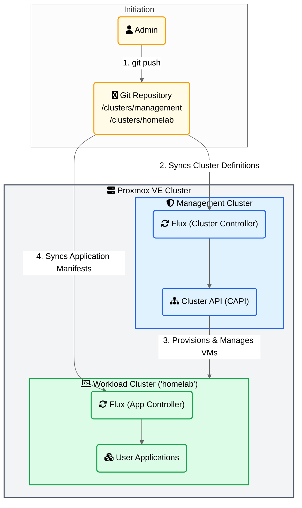

# GitOps-Managed Talos Kubernetes Clusters on Proxmox with Cluster API

This guide details the process of creating a robust, GitOps-driven Kubernetes environment on Proxmox VE. It leverages **Talos Linux** for a secure and minimal OS, **Cluster API (CAPI)** for declarative cluster lifecycle management, and **Flux** for continuous delivery from a Git repository.

The end result is a self-managing setup where a **management cluster** provisions and oversees one or more **workload clusters**, with all cluster configurations and application deployments managed entirely through Git.

---



---

## Table of Contents

1.  [Prepare Management Cluster Configuration](#1-prepare-management-cluster-configuration)
2.  [Customize Node Configuration](#2-customize-node-configuration)
3.  [Bootstrap the Management Cluster](#3-bootstrap-the-management-cluster)
4.  [Configure Proxmox for Cluster API](#4-configure-proxmox-for-cluster-api)
5.  [Initialize Cluster API Providers](#5-initialize-cluster-api-providers)
6.  [Enable GitOps with Flux](#6-enable-gitops-with-flux)
7.  [Access a New Workload Cluster](#7-access-a-new-workload-cluster)
8.  [Bootstrap Flux in the Workload Cluster](#8-bootstrap-flux-in-the-workload-cluster)

---

## 1\. Prepare Management Cluster Configuration

First, we'll generate the necessary configurations and certificates for our initial Talos node, which will become the management cluster.

1.  **Create a Directory**
    Create a dedicated directory for the configuration files.

    ```bash
    mkdir init
    cd init
    ```

2.  **Generate Secrets**
    Use `talosctl` to generate the required private keys and certificates for the cluster components.

    ```bash
    talosctl gen secrets
    ```

3.  **Generate Initial Config**
    Create the base configuration files. You must define a **cluster name** (`capi` in this example) and a **static control plane endpoint IP** that will be assigned to the first node.

    ```bash
    talosctl gen config capi https://192.168.179.170:6443
    ```

---

## 2\. Customize Node Configuration

We'll apply a patch to the generated configuration to define static networking for our control plane node.

1.  **Create a Patch File**
    Create a file named `patch.yaml` with your specific network details. This patch configures the node's hostname, static IP address, default gateway, and DNS servers. It also allows pods to be scheduled on control plane nodes.

    **`patch.yaml`**

    ```yaml
    machine:
      network:
        hostname: management
        interfaces:
          # Select the primary network interface based on its bus path.
          - deviceSelector:
              busPath: "0*"
            dhcp: false
            # Assign a static IP address to the node.
            addresses:
              - 192.168.179.170/23
            routes:
              # Define the default gateway for outbound traffic.
              - network: 0.0.0.0/0
                metric: 1024
                mtu: 1500
                gateway: "192.168.178.1"
        # Set the DNS servers.
        nameservers:
          - 192.168.178.1
    cluster:
      # Allow pods to be scheduled on control plane nodes.
      allowSchedulingOnControlPlanes: true
    ```

2.  **Apply the Patch**
    Use `talosctl` to apply the patch and generate the final `controlplane.yaml` file, overwriting the previous version.

    ```bash
    talosctl gen config capi https://192.168.179.170:6443 \
      --config-patch-control-plane @patch.yaml \
      --force
    ```

---

## 3\. Bootstrap the Management Cluster

Now it's time to bring the first node online and initialize the Kubernetes control plane.

1.  **Apply the Configuration**
    Apply the `controlplane.yaml` to your Proxmox VM. The node is targeted using its initial DHCP-assigned IP address (`192.168.178.42`). The `--insecure` flag is required because the node does not yet have a trusted configuration.

    ```bash
    talosctl apply-config --insecure \
      -n 192.168.178.42 \
      -e 192.168.178.42 \
      --file controlplane.yaml
    ```

    The node will reboot and apply its new static IP address.

2.  **Bootstrap Kubernetes**
    Once the node is back online at its new static IP (`192.168.179.170`), run the bootstrap command. This crucial step initializes the `etcd` database and starts the Kubernetes API server.

    ```bash
    talosctl bootstrap \
      -n 192.168.179.170 \
      -e 192.168.179.170 \
      --talosconfig ./talosconfig
    ```

3.  **Generate Kubeconfig**
    Finally, generate a `kubeconfig` file to interact with your new cluster using `kubectl`.

    ```bash
    talosctl kubeconfig \
      -n 192.168.179.170 \
      -e 192.168.179.170 \
      --talosconfig ./talosconfig \
      --merge=false
    ```

---

## 4\. Configure Proxmox for Cluster API

To allow Cluster API to provision VMs in Proxmox, we need to create a dedicated user and an API token with administrator privileges.

Run these commands in the Proxmox VE shell:

```bash
# Create a dedicated user for Cluster API
pveum user add capmox@pve

# Grant the user administrator permissions on the entire datacenter
pveum aclmod / -user capmox@pve -role Administrator

# Create a non-expiring API token for the user
pveum user token add capmox@pve capi -privsep 0
```

Take note of the **Token ID** (`capmox@pve!capi`) and the **Secret** that is generated.

---

## 5\. Initialize Cluster API Providers

Next, we install the Cluster API provider components into our management cluster.

1.  **Configure Credentials**
    `clusterctl` needs to know how to connect to Proxmox. Provide your credentials by setting environment variables or by creating a `~/.cluster-api/clusterctl.yaml` file.

    _Example `clusterctl.yaml` configuration:_

    ```yaml
    providers:
      - name: "talos"
        url: "https://github.com/siderolabs/cluster-api-bootstrap-provider-talos/releases/latest/bootstrap-components.yaml"
        type: "BootstrapProvider"
      - name: "talos"
        url: "https://github.com/siderolabs/cluster-api-control-plane-provider-talos/releases/latest/control-plane-components.yaml"
        type: "ControlPlaneProvider"
      - name: "proxmox"
        url: "https://github.com/ionos-cloud/cluster-api-provider-proxmox/releases/latest/infrastructure-components.yaml"
        type: "InfrastructureProvider"

    # Proxmox API connection details
    PROXMOX_URL: "https://192.168.179.171:8006"
    PROXMOX_TOKEN: "capmox@pve!capi"
    PROXMOX_SECRET: "<your-secret-from-previous-step>"
    ```

2.  **Install Providers**
    Initialize Cluster API with the Proxmox infrastructure provider and the Talos bootstrap/control plane providers.

    ```bash
    export KUBECONFIG=./kubeconfig

    clusterctl init \
      --infrastructure proxmox \
      --ipam in-cluster \
      --control-plane talos \
      --bootstrap talos
    ```

---

## 6\. Enable GitOps with Flux

Install Flux to connect the cluster to your Git repository. This Flux instance will manage the **management cluster** itself.

```bash
# Set your GitHub Personal Access Token
export GITHUB_TOKEN=YOUR_PAT_TOKEN

# Bootstrap Flux on the management cluster
flux bootstrap github \
  --owner=<YOUR_GITHUB_USERNAME> \
  --repository=<YOUR_REPO_NAME> \
  --branch=main \
  --path=clusters/management \
  --personal \
  --token-auth
```

---

## 7\. Access a New Workload Cluster

Once you define a workload cluster (e.g., `homelab-cluster`) in your GitOps repository, Cluster API will automatically provision it. Use the following commands to get access to the newly created cluster.

1.  **Retrieve Talosconfig**
    Get the `talosconfig` from the management cluster to interact directly with the workload cluster nodes at the OS level.

    ```bash
    export KUBECONFIG=./init/kubeconfig

    kubectl get secret \
      --namespace default homelab-cluster-talosconfig \
      -o jsonpath='{.data.talosconfig}' | base64 -d > talosconfig
    ```

2.  **Retrieve Kubeconfig**
    Use `clusterctl` to get the `kubeconfig` needed to interact with the workload cluster's Kubernetes API. This will be saved as `kubeconfig` in your root directory.

    ```bash
    export KUBECONFIG=./init/kubeconfig

    clusterctl get kubeconfig homelab-cluster > kubeconfig
    ```

---

## 8\. Bootstrap Flux in the Workload Cluster

Now that the `homelab-cluster` is running, install a dedicated instance of Flux inside it. This new Flux instance will be responsible for deploying and managing the applications defined in the `clusters/homelab` path of your repository.

1.  **Run Flux Bootstrap**
    Using the `kubeconfig` file generated in the previous step, run the bootstrap command again, but this time point it to the workload cluster's application path (`clusters/homelab`).

    ```bash
    # Set your GitHub Personal Access Token
    export GITHUB_TOKEN=YOUR_PAT_TOKEN
    export KUBECONFIG=./kubeconfig

    # Bootstrap Flux on the homelab-cluster, using its kubeconfig
    flux bootstrap github \
      --owner=<YOUR_GITHUB_USERNAME> \
      --repository=<YOUR_REPO_NAME> \
      --branch=main \
      --path=clusters/homelab \
      --personal \
      --token-auth
    ```

2.  **Verify Deployment**
    Flux will now begin to sync the manifests. You can check the status and see your applications being deployed directly on the workload cluster.

    ```bash
    # Target the new workload cluster
    export KUBECONFIG=./kubeconfig

    # Check the status of the Flux sync
    flux get kustomizations --namespace flux-system

    # After a few moments, check for your deployed applications
    kubectl get pods -A
    ```
